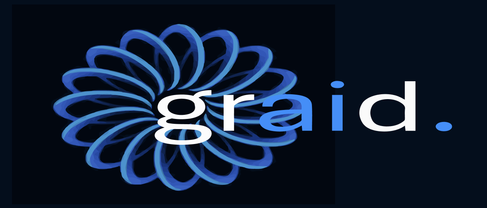
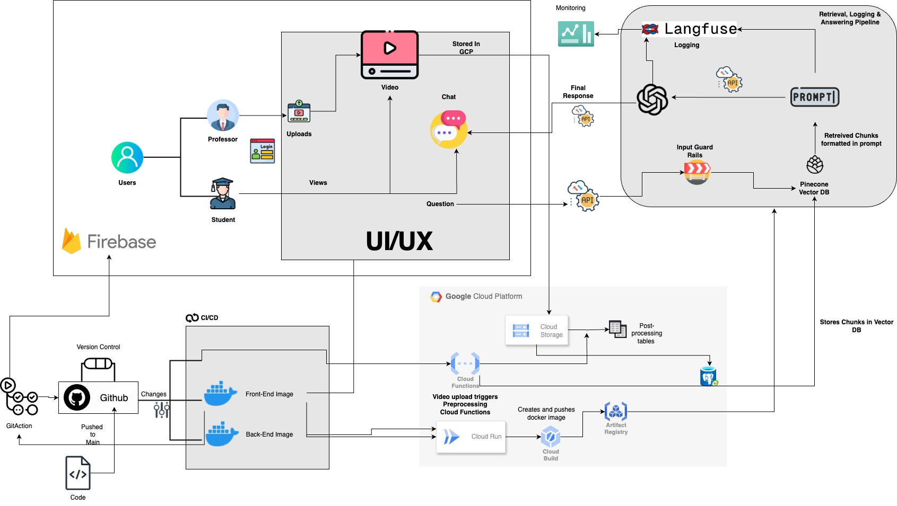

# AI-Powered Chatbot for Enhancing Digital Learning

This project develops an AI-driven chatbot designed to transform video lectures into interactive learning experiences. By integrating cutting-edge speech-to-text and language processing technologies with robust MLOps practices, the chatbot provides real-time, context-aware support for students and professors. The system leverages best practices from other MLOps projects—such as modular code structure, containerized deployments, and continuous monitoring—to ensure scalability, reliability, and continuous improvement.

---

## Table of Contents

1. [Overview](#overview)
2. [System Architecture](#system-architecture)
   - [Core Components](#core-components)
   - [Data & Integration Layers](#data--integration-layers)
3. [Data](#data)
4. [MLOps Implementation](#mlops-implementation)
   - [Development Pipeline](#development-pipeline)
   - [Deployment Strategy](#deployment-strategy)
   - [Monitoring & Maintenance](#monitoring--maintenance)
5. [Data Storage and Model Registry](#data-storage-and-model-registry)
6. [Airflow Pipelines](#airflow-pipelines)
7. [Benefits](#benefits)
8. [Conclusion](#conclusion)
9. [Contributors](#contributors)

---

## Overview

This project fuses advanced AI capabilities with a robust MLOps lifecycle to create a chatbot that enhances the digital learning experience. The chatbot transforms video lectures into dynamic, interactive sessions by processing audio in real time and providing contextual answers to student queries.

- **Advanced AI Capabilities:**
  - **Speech-to-Text Processing:** Real-time transcription of lecture audio.
  - **Language Understanding:** Leverages state-of-the-art language models (e.g., GPT, Groq) to interpret and respond to queries.
  - **Real-Time Interaction:** Delivers contextually relevant answers, enhancing the educational experience.

- **MLOps-Driven Lifecycle:**
  - **Streamlined Development:** Continuous integration, automated testing, and experiment tracking.
  - **Containerized Deployment:** Uses Docker and Kubernetes for scalable and reliable deployment.
  - **Automated Monitoring:** Implements robust monitoring tools for performance and feedback, inspired by best practices from similar MLOps projects.

---

## System Architecture

### Core Components

1. **User Interface (UI)**  
   - A streamlined **website** optimized for both students and professors.
   - Features dedicated login/sign-up pages and a responsive home page.
   - Supports **text and voice inputs** to facilitate seamless interaction.

2. **Speech-to-Text Engine**  
   - Transcribes lecture audio into text in real time.
   - Built using cloud-based services (and Groq Whisper) to ensure high accuracy and low latency.

3. **Natural Language Processing (NLP) Module**  
   - Processes transcribed text and user queries.
   - Utilizes advanced language models to understand context and generate precise responses.

4. **Response Generation & Contextual Linking**  
   - Integrates real-time transcription, lecture content, and interaction history.
   - Provides detailed, context-sensitive answers to enhance understanding of lecture material.

### Data & Integration Layers

1. **Lecture Content Repository**  
   - Stores video lectures and their transcripts.
   - Provides indexing and search capabilities for rapid retrieval of relevant lecture segments.

2. **Interaction History Database**  
   - Logs user queries, chatbot responses, and user feedback.
   - Enables personalized interactions and continuous system improvement.

3. **API Gateway**  
   - Facilitates secure and scalable communication between the UI, AI services, and backend databases.

---

## Data
We begin by ingesting raw lecture videos and converting their audio into text using state-of-the-art speech-to-text technology. The resulting transcripts are segmented and indexed in our secure cloud repository, enabling fast semantic search and context-aware retrieval. Continuous quality checks and feedback loops ensure that the processed data remains accurate and up-to-date for optimal chatbot performance.

### Input Details

#### Unstructured Input
- **Uploaded Lecture Videos**
  - **Size**: Adaptable to a variety of video sizes to suit different lecture lengths and resolutions.
  - **Format**:
    - **MP4**: Standard format for most digital videos, offering broad compatibility.
    - **AVI**: An older format that is still widely used for its robustness.
    - **FLV**: Commonly used for streaming video content on the internet.
    - **MKV**: Supports multiple audio and subtitle tracks in one file, suitable for complex lecture recordings.

#### Structured Input
- **CSV Files**
  - These files contain key data points that assist in querying the Language Learning Model (LLM) to retrieve relevant information efficiently.

### Output
- **Chatbot Responses**: Generates responses based on user queries. These responses are informed by:
  - **Lecture Video Content**: Analyzed through advanced speech-to-text and natural language processing technologies.
  - **Data from CSV Files**: Incorporates structured data to provide accurate and contextually relevant information.

---
## Project Workflow

---

## Prerequisites

- [Git](https://www.git-scm.com/downloads)
- [Docker](https://www.docker.com/get-started/)
- [Airflow](https://airflow.apache.org/docs/apache-airflow/stable/start.html)
- [DVC](https://airflow.apache.org/docs/apache-airflow/stable/start.html) (Data Version Control)
- [Python](https://www.python.org/downloads/) 3.x
- Pip (Python package installer)
- Google Cloud Platform (GCP) Account
- NodeJs
- npm
---
## MLOps Implementation

### Development Pipeline

- **Continuous Integration/Continuous Deployment (CI/CD):**  
  Automated testing (unit, integration, end-to-end) ensures robust code quality. Version control (Git) and experiment tracking (using tools like MLflow or LangFuse, inspired by medical imaging projects) allow iterative improvements and reproducibility.

- **Modular Code Structure:**  
  The project is organized into distinct modules (data ingestion, speech-to-text, NLP, response generation) to ensure that each component can be updated independently without affecting the overall system.

### Deployment Strategy

- **Containerization & Orchestration:**  
  All services are containerized using Docker. Kubernetes handles orchestration, ensuring scalability, load balancing, and fault tolerance.

### Monitoring & Maintenance

- **Performance Monitoring:**  
  LangFuse monitors key metrics (response time, error rates, resource usage). This continuous tracking ensures that any issues are promptly identified and resolved.

- **Feedback and Retraining Pipelines:**  
  User feedback is automatically logged and triggers retraining cycles if performance dips below defined thresholds—drawing on strategies proven effective in other MLOps projects.

---

## Data Storage and Model Registry

- **Cloud Storage:**  
  Lecture videos, transcripts, and user interaction logs are stored in secure cloud buckets (e.g., on GCP), ensuring high availability and redundancy.

- **Model Registry:**  
  Models, along with their versions and performance metrics, are tracked using Langfuse. This registry facilitates seamless rollbacks and model updates based on new data and feedback.

---

## Airflow Pipelines

- **Automated Workflows:**  
  Apache Airflow orchestrates the end-to-end data processing pipeline—from video ingestion and transcription to model retraining based on user feedback.
  
- **Pipeline Steps Include:**  
  - Data source verification and download.  
  - Transcription and indexing of lecture content.  
  - Integration of real-time queries and response generation.  
  - Automated email notifications for pipeline status updates.

---

## Benefits

- **Enhanced Engagement:**  
  Real-time, context-aware support improves comprehension and retention.
  
- **Scalability & Reliability:**  
  Containerized deployment and automated orchestration ensure that the system can scale to meet growing user demand.
  
- **Continuous Improvement:**  
  Automated monitoring and retraining pipelines keep the system up-to-date and relevant.
  
- **Operational Efficiency:**  
  Streamlined CI/CD processes reduce downtime and accelerate feature rollouts.

---

## Conclusion

By integrating advanced AI capabilities with proven MLOps methodologies—drawing inspiration from high-impact projects in diverse fields—the AI-powered chatbot revolutionizes digital learning. It offers an interactive, scalable, and continuously improving solution that meets the evolving needs of students and professors alike.

---

## Contributors

[Anish Hegde](https://github.com/ahegde3)   
[Arya Gowda](https://github.com/aryagowda11)  
[Bhavya Pandey](https://github.com/bhavypandey)  
[Nikhileshwar Bommareddy](https://github.com/Nikhileshwarreddybommareddy)   

---

## Acknowledgments

Special thanks to our Professor, [Ramin Mohammadi](https://github.com/raminmohammadi), for his guidance and support throughout this project.

Feel free to explore the repository, provide feedback, and contribute to further enhancing the digital learning experience through this AI chatbot.
